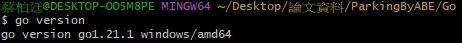
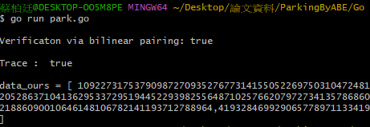

# 使用 Golang 與第三方 library 撰寫密碼學相關程式  

備註：
> 由於橢圓曲線的參數設定多種多樣，其他地方的第三方 library 產出的數據，  
> 未必可以使用 ethereum 上的 pre-compiled smart contract 提供的 equality test 進行比對的動作  
> 如果未來有需要實作，需要注意這一個問題  
> 本程式碼使用的 library 可以兼容 ethereum 上，定義在 BN256 上的演算法  

## 一、環境

1. Windows 安裝環境

Windows 版本：
> Windows 10 專業版

系統：
> 處理器： Intel(R) Core(TM) i5-6500 CPU @ 3.20GHz 3.19GHz  
> 記憶體(RAM)： 8.00 GB  
> 系統類型： 64位元作業系統，x64型處理器  

## 二、安裝

1. 官網下載並安裝執行檔：[官網](https://golang.org/doc/install)

查詢 Golang 版本：go1.16 windows/amd64  

```CMD
go version
```



## 三、環境設定與執行

1. 請將資料夾中的 clearmatics/ 移動到 $GOPATH/src 底下，並執行以下指令(每次執行前都需要執行一次本指令)  

- 該 library 修改自：[https://github.com/clearmatics/bn256](https://github.com/clearmatics/bn256)  
- 由於修改了部分 source code，所以沒辦法直接使用 go get 的方式抓下來使用  
- 記得執行下列命令取消 go module 的使用  
```CMD
set GO111MODULE=off
```

2. 執行主程式  

```CMD
go run main.go
```

