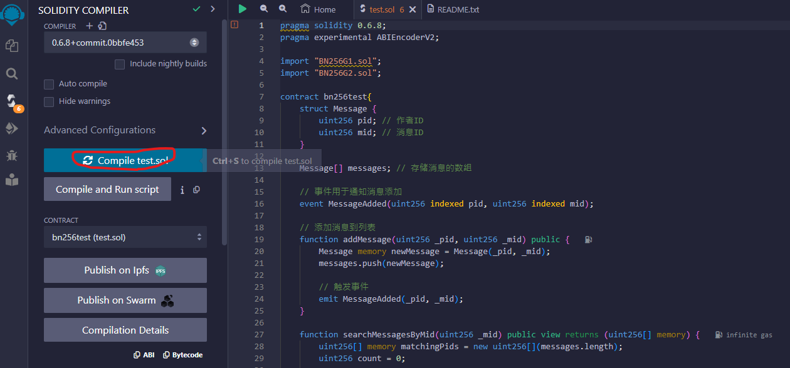
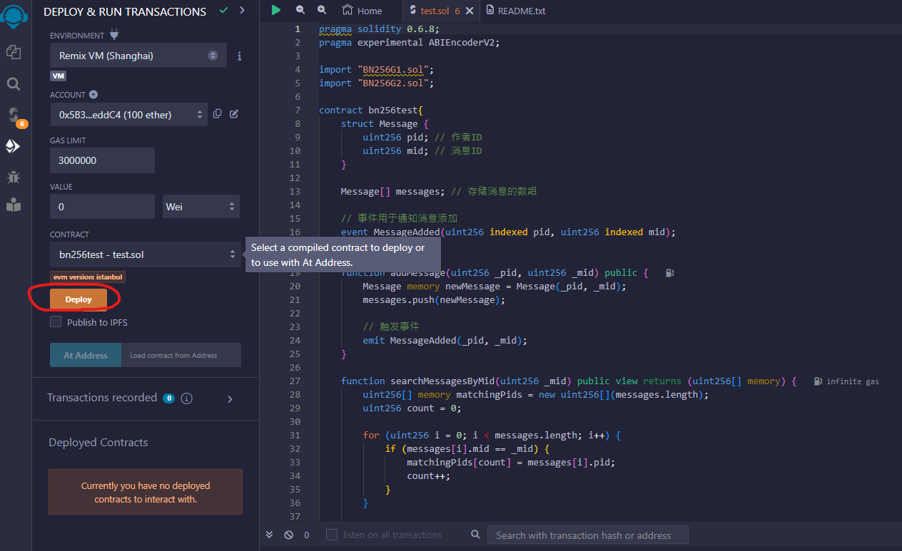
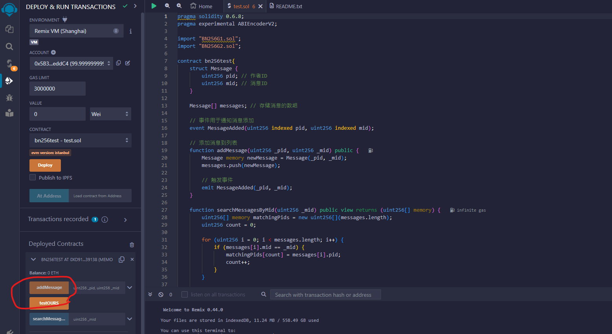
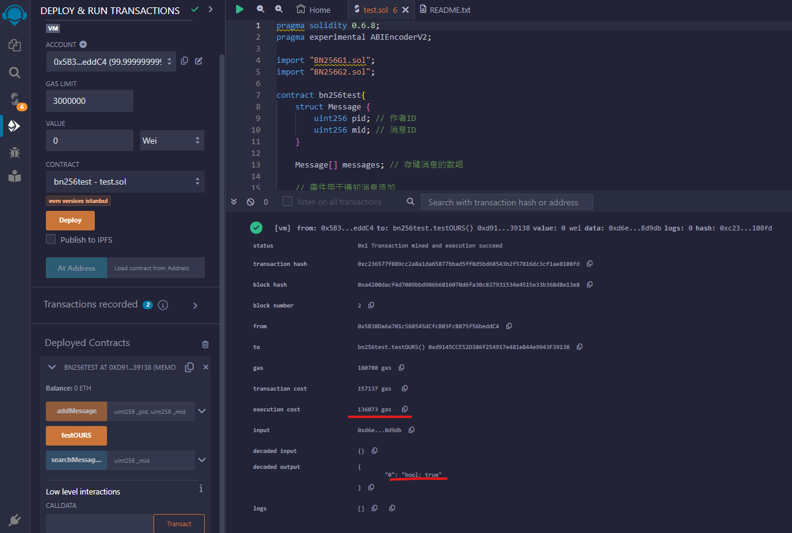
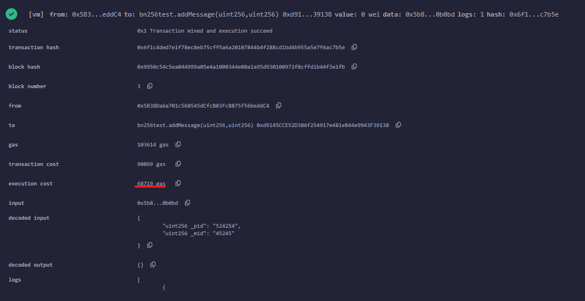

# 關於 smart contract 的撰寫與執行

## 一、環境

1. 環境

Ethereum Remix IDE：[網址](https://remix.ethereum.org/)

## 二、執行

1. 將資料夾下的 "test.sol"、"BN256G2.sol"、"BN256G1.sol" 放置到 Remix IDE 上  
- 其中 "BN256G2.sol"、"BN256G1.sol" 為在橢圓曲線 BN256 上實現的 G1 與 G2 solidity library  
- "test.sol" 為我們實作的 scheme 下的 smart contract，其中包含 verify 和 addMessage

2. 在 Remix IDE 上打開你想部屬的 smart contract，先編譯他，如下圖  

3. 編譯完成後，如果沒問題，即可進行部屬的動作

備註：
- 運算量過大的話，瀏覽器頁面會直接 crash  
- GAS LIMIT 不足的話可以嘗試調高  

4. 部屬完成後如下圖，點擊圖中的 "testOurs" 按鈕即可送出交易  

該按鈕對應到 smart contract 中的 "testOURS" function  
該 function 使用的參數來自 solidity 中的 uint256[8] data_ours 變數  
> 變數內容為預先填好的數值，數值生成方法可以參考 "Go/" 資料夾底下的 [README.md](../Go/README.md)  
> 為什麼要預先填入，原因是因為 Remix IDE 無法吃下過長的 input，折衷使用預先填入的方式進行測試  

5. 確認交易結果，如下圖  

圖中紅線處即為 verify 的結果  
另外因運算所造成的消費 (execution cost) 為 136073 gas  

AddMessage 所造成的消費 (execution cost) 為 68719 gas  

## 三、參考資料

1. 橢圓曲線 BN256 library：[https://github.com/witnet/bls-solidity](https://github.com/witnet/bls-solidity)  
2. Pre-compiled smart contract 相關資料：[https://eips.ethereum.org/](https://eips.ethereum.org/)  
